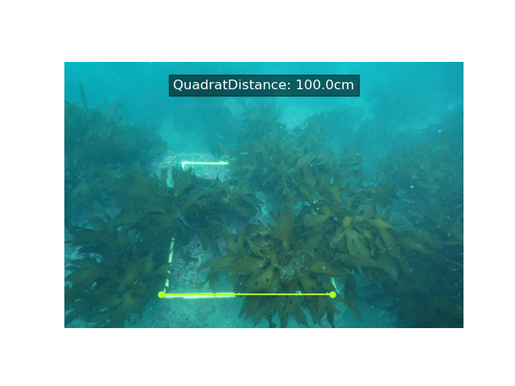
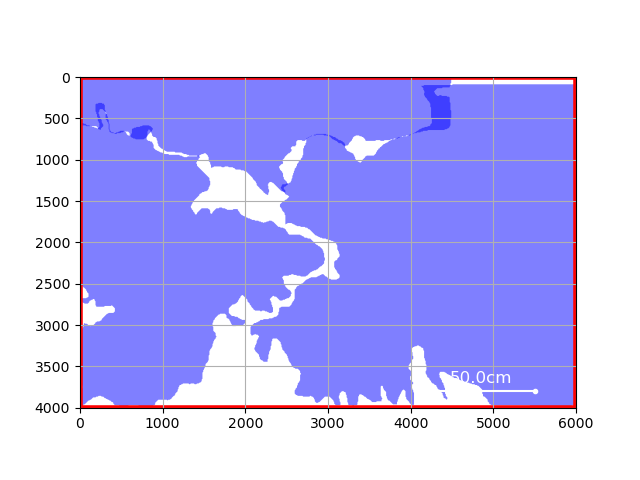

# PolygonAreaSegmentation


## Overview
The meaPolygon function calculates the area of polygons based on coordinates provided in a text file and corresponding image dimensions. This function is useful for tasks where polygonal regions of an image need to be analyzed, such as in image segmentation or object detection.

Additionally, this function is designed to work with text files formatted for semantic segmentation in the YOLO format. This means that it can accurately process polygon coordinates that are normalized relative to image dimensions, as commonly used in YOLO-based object detection and segmentation tasks.

<p align="center">
  
  
</p>
<p align="center">
  <b>Original</b> &nbsp;&nbsp;&nbsp;&nbsp;&nbsp;&nbsp;&nbsp;&nbsp;&nbsp;&nbsp;&nbsp;&nbsp;&nbsp;&nbsp;&nbsp;&nbsp;&nbsp;&nbsp;&nbsp;&nbsp;&nbsp;&nbsp;&nbsp;&nbsp;&nbsp;&nbsp;&nbsp;&nbsp;&nbsp;&nbsp;&nbsp;&nbsp;&nbsp;&nbsp;&nbsp;&nbsp;&nbsp;&nbsp;&nbsp;&nbsp;&nbsp;&nbsp;&nbsp;&nbsp;&nbsp;&nbsp;&nbsp;&nbsp;&nbsp;&nbsp;&nbsp;&nbsp;&nbsp;&nbsp;&nbsp;&nbsp;&nbsp;&nbsp;&nbsp;&nbsp;&nbsp;&nbsp;&nbsp;&nbsp;&nbsp;&nbsp;&nbsp;&nbsp;&nbsp;&nbsp;&nbsp; <b>Yolo format Semantic Segmentation</b>
</p>


## Installation

First, install the necessary dependencies. After cloning or downloading this project, run the following command to install the package:

```bash
pip3 install .
```

This will install the module containing the meaPolygon function, making it available for use in your Python environment.


## Usage

1. Prepare the YOLO Format Text File
Prepare a text file formatted for YOLO semantic segmentation. Each line should contain a label and normalized polygon coordinates.

Example:
```
0 0.1 0.2 0.3 0.4 0.5 0.6
1 0.2 0.3 0.4 0.5 0.6 0.7
```

2. Create a Python Script

```python
from my_module.polygon_area import meaPolygon

# Specify the paths to the image file and the text file
img_path = "examples/data/example.png"
txt_path = "examples/data/example.txt"

# Calculate the polygon areas
areas = meaPolygon(img_path, txt_path)

# Display the results
print("Calculated Polygon Areas:", areas)

```

3. Run the Script

```bash
python3 your_script.py
```